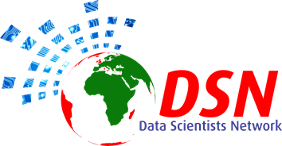
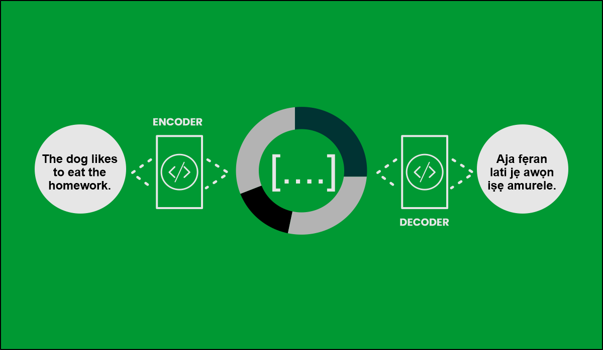

# DSN-AI-Hackathon-2024-Low-Resource-Translation-English-Yoruba-Using-MT5-Model

# Overview
This repository contains code and resources for a neural machine translation project using the mT5 (Multilingual Translation Transformer) model. The goal is to develop a sophisticated translation system leveraging state-of-the-art natural language processing techniques. In essence, we'll be using a Neural Machine Translation (NMT) model that translates texts from English to Yoruba, a popular low-resource language spoken by more than 50 million people.

## About NMTs

NMT is a developing AI technology that uses deep learning to translate sentences from one language to another. Like the human brain, NMT gets smarter over time by building connections. For example, NMT can be trained to understand that the word “car” is related to “auto,” “automobile,” “vehicle,” and “cars.” Older methods of machine translation can’t build connections like this. And to link it up, Multilingual T5 (MT5) is a text-to-text transformer that was pre-trained on Common Crawl-based dataset covering 101 languages.

## Objectives
* Carry out data-preprocessing to evaluate the quality of the input/output text data.
* Explore the dataset to understand the sentence length of each language.
* Training the MT5 model on a pre-trained obtained from Hugging Face for more accuracy.
* Evaluate the translation performance based on the appropriate metrics: BLEU score.

## Environment setup and Packages Installation

  

## Data Preprocessing

## Exploratory Data Analysis

## Model training

## Evaluation and Conclusion
Bilingual Evaluation Understudy
