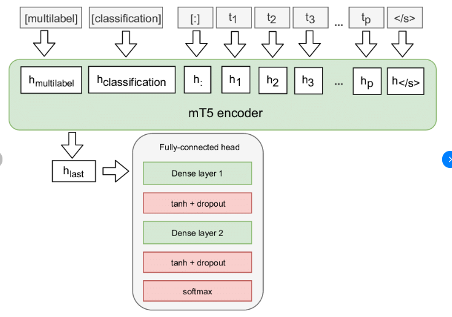

# DSN-AI-Hackathon-2024-Low-Resource-Translation-English-Yoruba-Using-MT5-Model

# Overview
This repository contains code and resources for a neural machine translation project using the mT5 (Multilingual Translation Transformer) model. The goal is to develop a sophisticated translation system leveraging state-of-the-art natural language processing techniques. In essence, we'll be using a Neural Machine Translation (NMT) model that translates texts from English to Yoruba, a popular low-resource language spoken by more than 50 million people.


## About NMTs

NMT is a developing AI technology that uses deep learning to translate sentences from one language to another. Like the human brain, NMT gets smarter over time by building connections. For example, NMT can be trained to understand that the word “car” is related to “auto,” “automobile,” “vehicle,” and “cars.” Older methods of machine translation can’t build connections like this. And to link it up, Multilingual T5 (MT5) is a text-to-text transformer that was pre-trained on Common Crawl-based dataset covering 101 languages.


## Objectives
* Carry out data-preprocessing to evaluate the quality of the input/output text data.
* Explore the dataset to understand the sentence length of each language.
* Training the MT5 model on a pre-trained obtained from Hugging Face for more accuracy.
* Evaluate the translation performance based on the appropriate metrics: BLEU score.


## Environment setup and Packages Installation

<p align="left">
  
</p>
Adapted from: 

[Localize](https://localizejs.com/articles/exploring-neural-machine-translation-nmt#:~:text=The%20Architecture%20of%20Neural%20Machine%20Translation%20(NMT),-An%20NMT%20computer&text=These%20neural%20networks%20translate%20entire,encoder%2Dattention%2Ddecoder%20model.)

## Data Preprocessing

<p align="left">
  
</p>

_Source: Author's computation_

## Exploratory Data Analysis

<p align="left">
  
</p>

_Source: Author's computation_

On average, Yoruba sentences tend to be longer than English. Also, the distribution is slightly skewed to the right indicating that there are fewer longer sentences.


<p align="left">
  
</p>

_Source: Author's computation_

On the test data however, the English texts appear to be longer compared to their corresponding Yoruba pairs.

## Model training

<p align="left">
  
</p>

*Source: López, 2022.*

[Fine-tuning mT5-based Transformer via CMA-ES for Sentiment Analysis](https://www.researchgate.net/figure/MT5-encoder-model-overview-with-additional-fully-connected-head_fig1_363234400)


## Evaluation and Conclusion

EDA shows that the train and validation datasets contained 76 and 45 sentence pairs respectively. This implied that moving on, the duplicate had to be removed.

The translated text in the test set was evaluated using the Bilingual Evaluation Understudy (BLEU) score. And a BLUE score of 13 suggests that the translation is performing fairly well.

The snippet below shows a sample of the translation.

```python
# Define the input text for translation (English sentence)
input_text_2 = "My name is Oyinda, I am participating in the DSN hackathon with my teammate, Uthman."

# Use the model to predict the translation (English to Yoruba)
predictions_2 = model.predict([input_text_2])

# Print the prediction
print(f"Translated Text (Yoruba): {predictions_2[0]}")
```

#### Translated text: Orúkọ mi ni Oyinda, mo ń kópa nínú ìdíje DSN pẹ̀lú Uthman, ọ̀kan lára àwọn akẹẹgbẹ́ mi.


The MT5 model is readily available on [hugging face](https://huggingface.co/google/mt5-small)


## Other References

1. [Comparing Facebook’s M2M to mT5 in low resources translation (English-Yoruba)](https://towardsdatascience.com/comparing-facebooks-m2m-to-mt5-in-low-resources-translation-english-yoruba-ef56624d2b75)
2. [How to Train an mT5 Model for Translation With Simple Transformers](https://towardsdatascience.com/how-to-train-an-mt5-model-for-translation-with-simple-transformers-30ba5fa66c5f)
